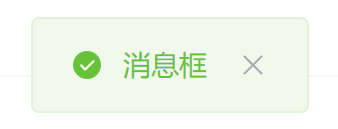
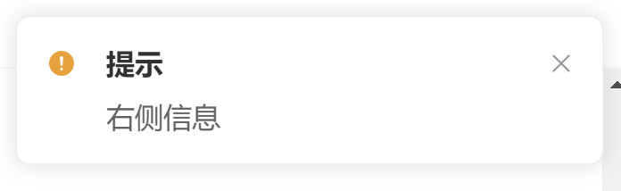

# CC Tools 使用说明

CC Tools 是被 `src/utils/tools.ts` 导出的 `cc` 对象，包含了几乎所有常用基础功能的代码封装。

## 路由切换

### 跳转到Tab页

::: tip
如果你还不知道Tab页和Stack页的区别，请先阅读[工程指南](/guide.md)中对应的介绍。
:::

传入希望跳转的Tab路径，可选地传入查询内容，用于传递参数给目标Tab页。

```ts
// 仅用于切换到某Tab页
switchTab(path: string, query?: Record<string, any>): void
```

请注意传入的 `path` 会自动在前面拼接上Tab页的标识符，所以不需要手动传入。

### 跳转到Stack页

传入希望跳转的Stack页路径，可选地传入查询内容，用于传递参数给目标Stack页。

```ts
// 导航到某非Tab页
navigateTo(path: string, query?: Record<string, any>): void
```

请注意传入的 `path` 会自动在前面拼接上Stack页的标识符，所以不需要手动传入。

### 回到上一页

回到上一个访问的页面。

```ts
// 回到上一页
navigateBack(): void
```

## 全局交互

### 弹出对话框

对话框可以容纳一段消息，也可包含自定义标题，提供确认按钮和（可选地）取消按钮。通常用于用户操作的二次确认。

```ts
// 显示对话框
modal(message: string, title?: string, cancelable = true): Promise<any>
```

- 传入参数

    |参数|必须传入|默认|备注|
    |:--:|:--:|:--:|:--:|
    |message|是|/|对话框中的消息内容|
    |title|否|"提示"|对话框标题|
    |cacelable|否|true|是否显示取消按钮|

- 返回值
  
  一个 `Promise`，用户**点击了确认**后成功回调，用户**点击了取消**或点击了**背景遮罩层**后失败回调

  ::: tip
  最佳实践：在编写业务代码时，你应该在 `.then` 回调中执行经过用户确认的操作，而 `.catch` 回调仅仅是指明了**用户没有点击确认**这件事
  :::

可以参考下面的用例，也可以改写成 `async/await` 风格，用 `try / catch` 代替 `.then / .catch`

```ts
cc.modal('确认要退出登录吗')
.then(() => {
    // 执行确认的业务代码
    // ...
})
.catch(() => {
    console.log('用户没有点击确认')
})
```

### 弹出消息框


消息框是一个（可选的）包含图标的迷你信息提示框，表现为在显示区域顶部弹出。消息框通常用于提示用户简短的信息。

传入一段消息内容，并且可选地传入类型：

- info：灰色的提示框
- error：红色的警示框
- warning：橙色的警示框
- success：绿色的成功框

```ts
// 消息
message(message: string, type?: 'info' | 'error' | 'success' | 'warning'): void
```

### 弹出通知栏



提示栏能够容纳比消息框更多的信息，通常遮挡住更多的屏幕空间，具体表现为从右往左弹出的可关闭信息框。

```ts
notify(message: string, type?: 'info' | 'error' | 'success' | 'warning', title?: string, duration = 2000): void
```

- 传入参数

    |参数|必须传入|默认|备注|
    |:--:|:--:|:--:|:--:|
    |message|是|/|通知框中的消息内容|
    |type|是|/|通知类型|
    |title|否|"提示"|通知框标题|
    |duration|否|2000|自动关闭的时间|
- 返回：`void`

::: tip
当 `type` 有传入参数时，通知栏就会附带左侧的图标，对应了传入的 `type`
:::

## 文件选择

打开系统文件选择器，返回一个 `promise`，若用户已选择文件，则会在成功回调中传入。

```ts
(accept?: string[], multiple = false): Promise<FileList>
```

其中：

```ts
type FileList = File[]
```

- 传入参数（都为可选参数）
    |参数|默认|备注|参数类型|示例
    |:--:|:--:|:--:|:--:|:--:|
    |accept|/|文件类型(后缀)|string[] | ['.png', '.jpg']|
    |multiple|false|是否接受多选|boolean|false|

- 返回值
  
  返回一个 `Promise`，成功回调的传入参数为用户选择的文件列表（`File[]`）

  ::: tip
  只要用户选择了文件，就一定会进入成功回调，且无论多选还是单选，成功回调的入参都一定是**数组**，也就是 `File[]`
  :::

- 示例
  
  ```ts
  cc.chooseFile(['.png', '.jpg'], true)
    .then(files => {
        cc.notify(`已选择${files.length}个文件`, 'success')
        console.log(files)
    })
    .catch(e => console.log(e))
  ```
